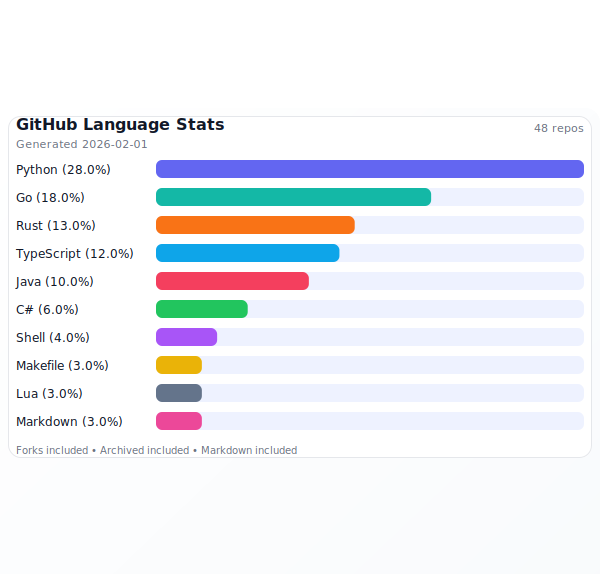
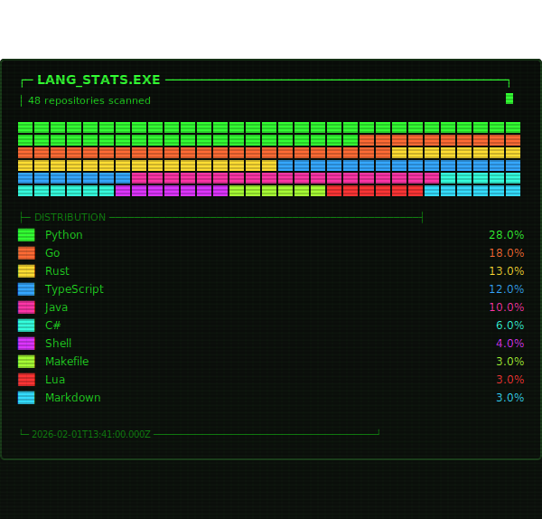
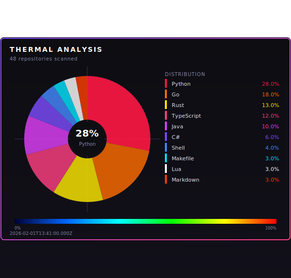
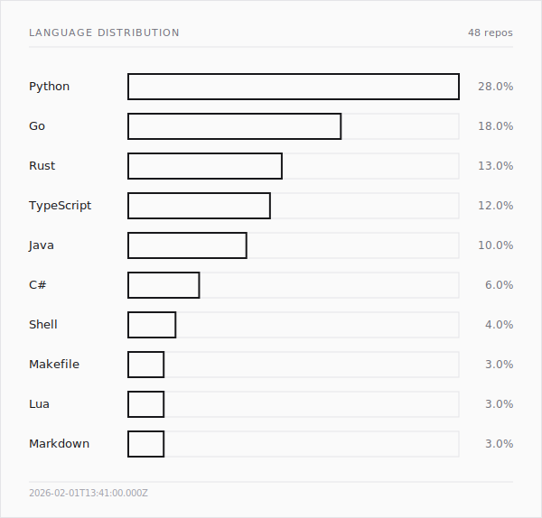
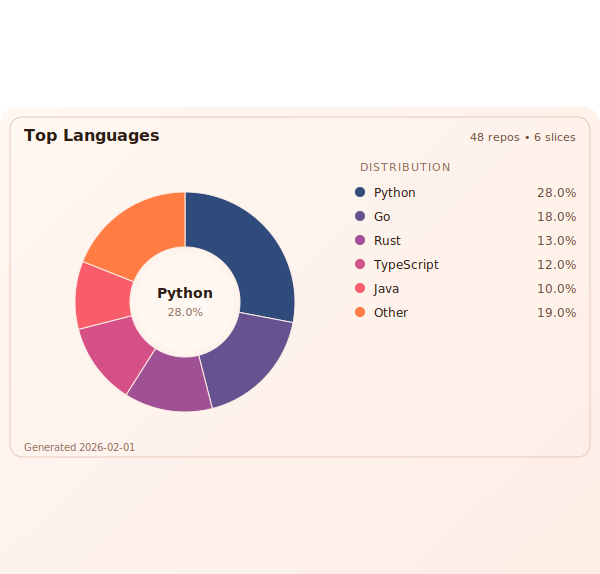

# gh-stats

Generate GitHub language stats as JSON or SVG charts with multiple themes.

## Requirements

- Node.js 18+ (for built-in `fetch`)
- pnpm 10 (see `packageManager` in `package.json`)
- A GitHub token with access to private repositories if needed

## Setup

```bash
pnpm install
pnpm run build
```

## Usage

## Run with npx (no install)

```bash
GITHUB_TOKEN=your_token npx @saadjs/gh-stats --svg --out stats.svg
```

```bash
npx @saadjs/gh-stats --svg --theme phosphor --in data.json --out stats.svg
```

## Install CLI command

Build first, then link globally or install from the local path.

```bash
pnpm run build
pnpm link --global
```

Or:

```bash
pnpm run build
pnpm add -g .
```

### JSON (default)

```bash
GITHUB_TOKEN=your_token gh-stats
```

<details>
<summary>JSON schema (for custom inputs)</summary>

```json
{
  "type": "object",
  "required": [
    "totalBytes",
    "languages",
    "generatedAt",
    "repositoryCount",
    "includedForks",
    "includedArchived",
    "includedMarkdown"
  ],
  "properties": {
    "totalBytes": { "type": "number" },
    "languages": {
      "type": "array",
      "items": {
        "type": "object",
        "required": ["language", "bytes", "percent"],
        "properties": {
          "language": { "type": "string" },
          "bytes": { "type": "number" },
          "percent": { "type": "number" }
        },
        "additionalProperties": false
      }
    },
    "generatedAt": { "type": "string", "format": "date-time" },
    "repositoryCount": { "type": "number" },
    "includedForks": { "type": "boolean" },
    "includedArchived": { "type": "boolean" },
    "includedMarkdown": { "type": "boolean" },
    "analysisSource": { "type": "string", "enum": ["api", "clone"] },
    "analysisMethod": { "type": "string", "enum": ["repo_bytes", "changed_lines"] },
    "engine": { "type": "string", "enum": ["github-linguist"] },
    "skippedRepositories": {
      "type": "array",
      "items": {
        "type": "object",
        "required": ["fullName", "reason"],
        "properties": {
          "fullName": { "type": "string" },
          "reason": { "type": "string" }
        },
        "additionalProperties": false
      }
    },
    "window": {
      "type": "object",
      "required": ["days", "since", "until", "activityField"],
      "properties": {
        "days": { "type": "number" },
        "since": { "type": "string", "format": "date-time" },
        "until": { "type": "string", "format": "date-time" },
        "activityField": { "type": "string", "enum": ["pushed_at", "changed_lines"] }
      },
      "additionalProperties": false
    }
  },
  "additionalProperties": false
}
```

</details>

### SVG

```bash
GITHUB_TOKEN=your_token gh-stats --svg --out stats.svg
```

<details>
<summary>Theme previews</summary>

**--theme default**


**--theme phosphor**


**--theme infrared**


**--theme outline**


**--theme pie**


</details>

### Cache JSON once, render SVG offline

Generate the JSON once, then re-render SVGs with different themes without hitting the GitHub API.

```bash
GITHUB_TOKEN=your_token gh-stats --json --out data.json
```

```bash
gh-stats --svg --theme phosphor --in data.json --out stats.svg
gh-stats --svg --theme infrared --in data.json --out stats.svg
gh-stats --svg --theme pie --in data.json --out stats.svg
```

## Keeping stats updated (profile README)

Use a scheduled GitHub Actions workflow to regenerate `stats.svg` and commit it back to the
profile README repo (`<username>/<username>`).

<details>

<summary>Example workflow setup</summary>

Create `.github/workflows/update-stats.yml` in the profile repo:

```yaml
name: Update GH Stats

on:
  schedule:
    - cron: "0 6 * * *" # daily at 06:00 UTC
  workflow_dispatch:

permissions:
  contents: write

jobs:
  build:
    runs-on: ubuntu-latest
    steps:
      - uses: actions/checkout@v4
      - uses: pnpm/action-setup@v3
        with:
          version: 10
      - uses: actions/setup-node@v4
        with:
          node-version: 20
          cache: pnpm

      - run: pnpm install
      - run: pnpm run build
      - run: GITHUB_TOKEN=${{ secrets.GH_TOKEN || secrets.GITHUB_TOKEN }} gh-stats --svg --out stats.svg

      - run: |
          if [[ -n "$(git status --porcelain)" ]]; then
            git config user.name "github-actions[bot]"
            git config user.email "github-actions[bot]@users.noreply.github.com"
            git add stats.svg
            git commit -m "chore: update language stats"
            git push
          fi
```

</details>

Notes:

- For public-only stats, `GITHUB_TOKEN` is enough.
- For private repos, add a PAT as `GH_TOKEN` in repo secrets (with `repo` scope).
- Embed the SVG in your profile `README.md` with ``.

### Options

- `--token <token>` GitHub access token (or use `GITHUB_TOKEN`)
- `--format <json|svg>` choose output format
- `--json` output JSON
- `--svg` output SVG
- `--theme <name>` choose SVG theme: default, phosphor, infrared, outline, pie
- `--in <path>` read precomputed stats JSON (skips GitHub API)
- `--include-forks` include forked repositories (default: excluded)
- `--exclude-archived` exclude archived repositories (default: included)
- `--include-markdown` include Markdown/MDX in language stats (default: excluded)
- `--past-week` past 7-day activity (filters to repos pushed in last 7 days)
- `--source <api|clone>` choose analysis source (default: api)
- `--clone-concurrency <n>` max concurrent clones in clone mode (default: 3)
- `--tmp-dir <path>` temp directory for clone mode (default: OS temp dir)
- `--linguist-engine <local|docker>` choose github-linguist engine (default: local)
- `--author <username>` limit clone past-week churn to one author
- `--all-authors` include all authors in clone past-week mode
- `--include-markup-langs` include markup/config languages (JSON, YAML, HTML, XML, etc.)
- `--include-repo-composition` include full repo composition alongside weekly churn in clone past-week mode
- `--cache-dir <path>` cache directory for cloned repositories
- `--no-cache` disable clone cache
- `--top <n>` limit to top N languages (default: 10)
- `--all` include all languages (overrides `--top`)
- `--out <path>` write output to a file
- `--help` / `-h` show help

### Analysis sources

`--source api` (default)

- Uses GitHub's languages API (repo byte totals).
- `--past-week` filters repos by `pushed_at`, then aggregates full repo bytes.

`--source clone`

- Clones repositories locally and runs `github-linguist` for language detection.
- Requires `git` and either `github-linguist` (local) or `docker` (docker engine) on your PATH.
- `--past-week` first filters repos by `pushed_at`, then aggregates line churn ($added + deleted$) from the last 7 days per language.
- For author-filtered past-week mode, repos are additionally prefiltered via GitHub commits API to avoid cloning repositories with no matching recent commits.
- By default in `--past-week`, churn is filtered to commits authored by the authenticated GitHub username.
- Use `--all-authors` to disable author filtering, or `--author <username>` to override.
- Markup/config languages are excluded by default; use `--include-markup-langs` to opt in.
- Clone cache is enabled by default; use `--cache-dir` to control location or `--no-cache` to disable.
- Use `--include-repo-composition` to add full-repository composition (`repoComposition`) alongside churn results (`weeklyChurn`).
- Continues when a repo fails and records skipped repositories in output metadata.

## Token scopes

For private repos, use a token with `repo` scope. For public-only, `public_repo` is enough.

## Testing

```bash
pnpm test
```

## Notes

GitHub’s API reports language byte totals per repository, not per-user LOC. Per-user attribution requires cloning and analyzing repositories locally.
